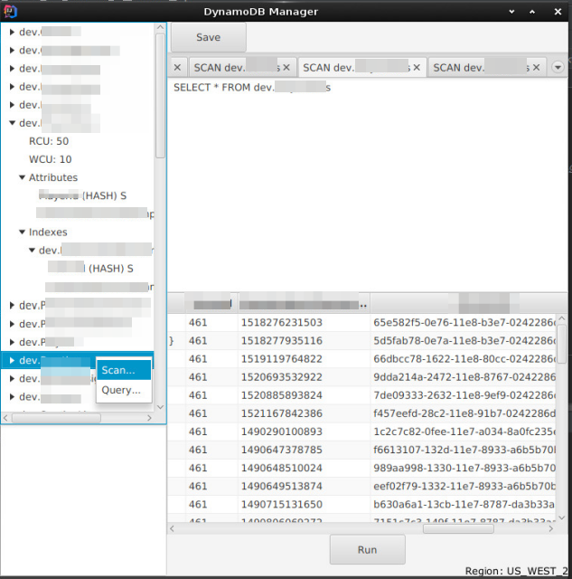

## Dynoman - DynamoDB management UI

****

### To run

`AWS_PROFILE=<application specific profile> ./gradlew run` 
(although right now it connects to the `US_WEST_2` region, config window is coming).
 