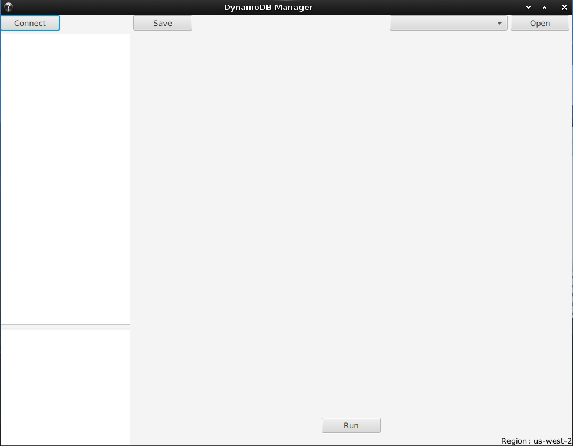
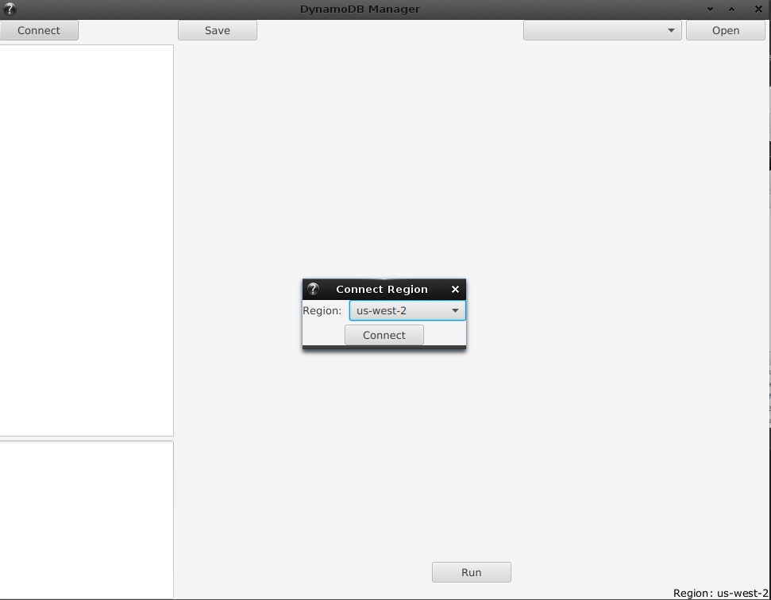
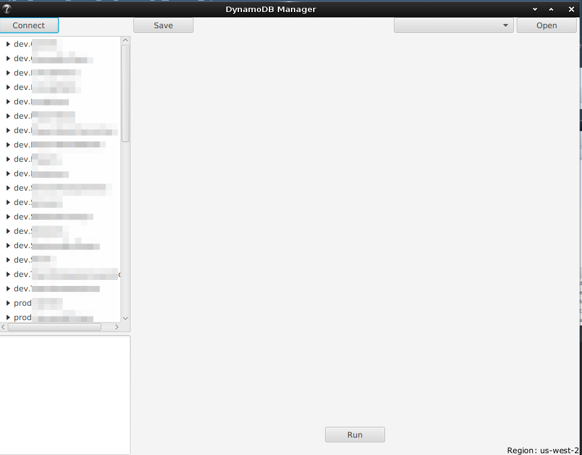
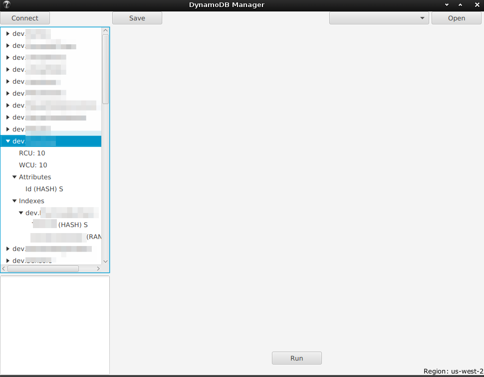
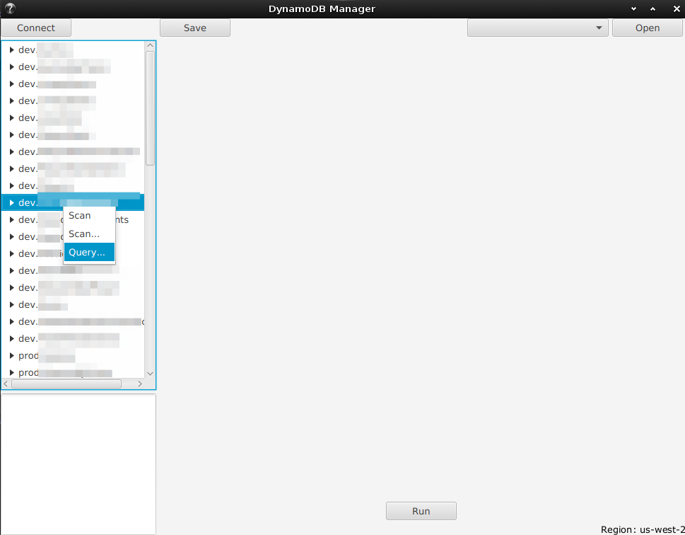
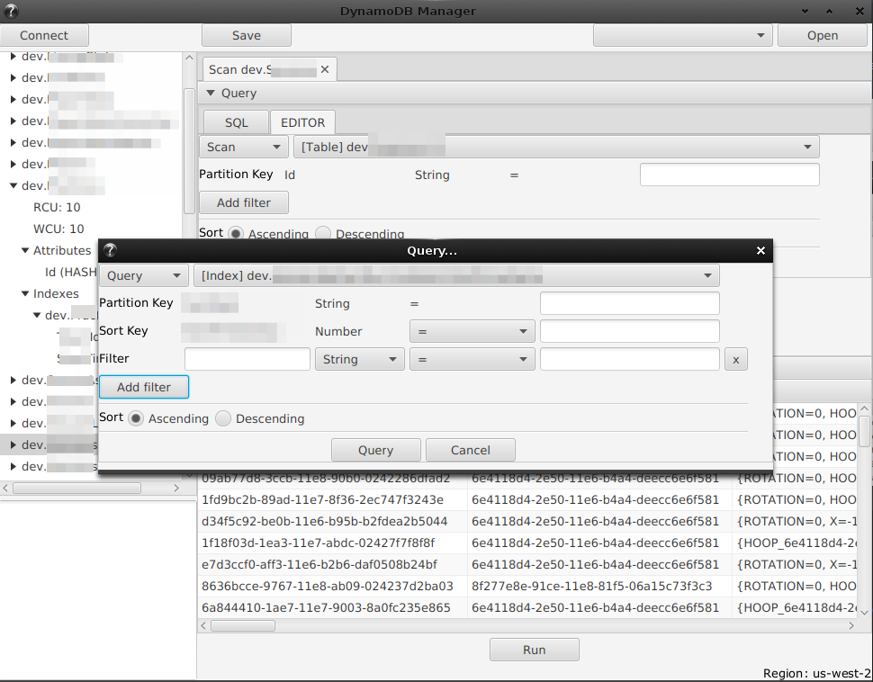
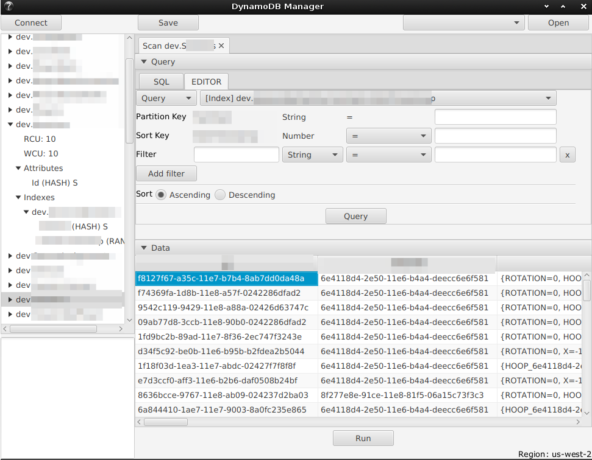
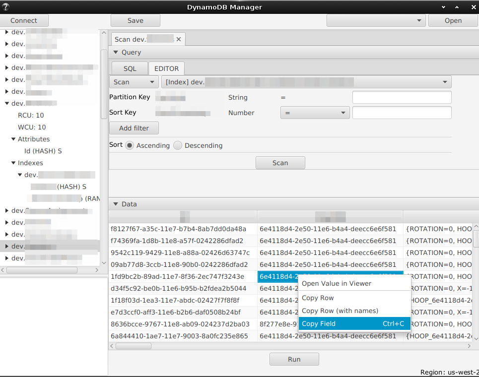

## Dynoman - DynamoDB management UI

****

### To run

`gradle run`

To install `gradle` best way is to use [SDKMAN!](https://sdkman.io/): `sdk install gradle`.

### Support :heart:

You can support this (and other projects) on [Patreon](https://www.patreon.com/akazlou) :+1: and :star2: it here on GitHub! 
