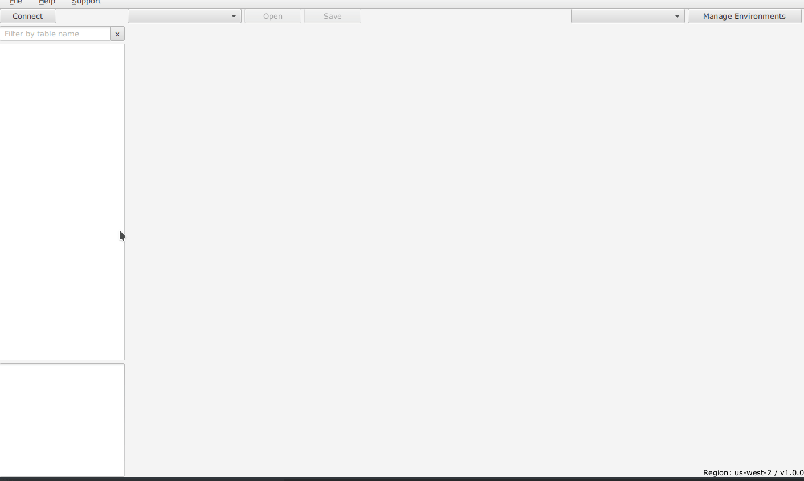
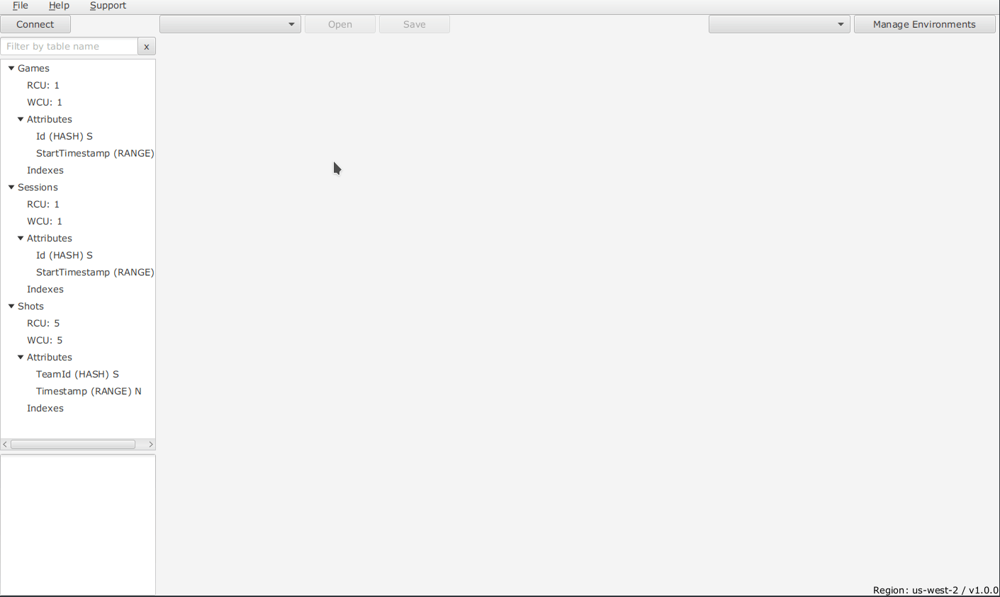
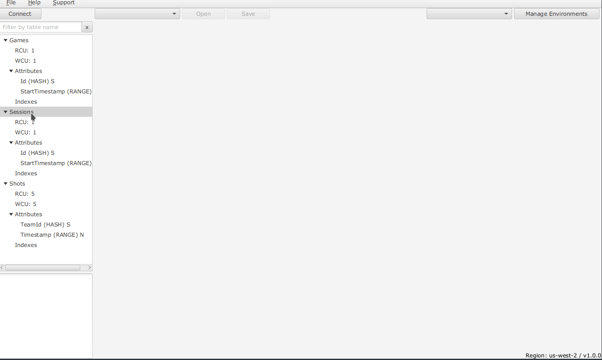
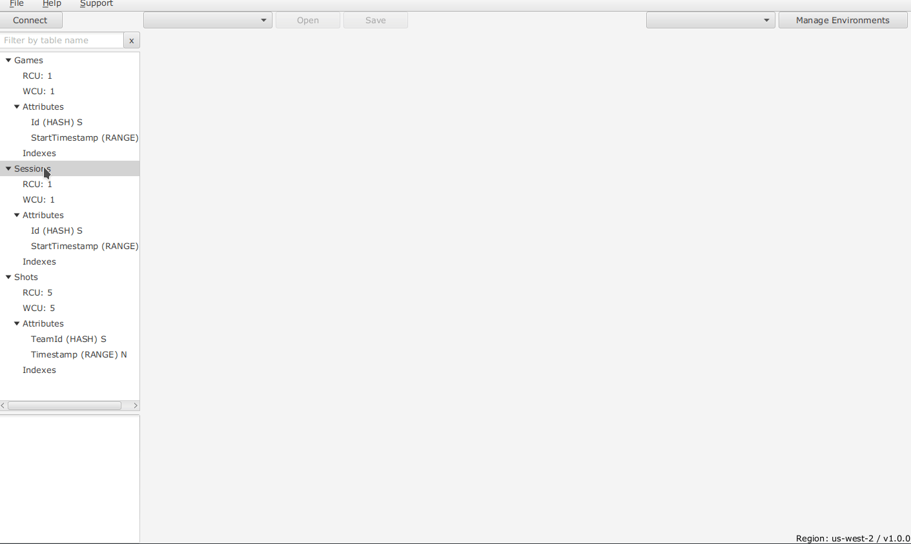
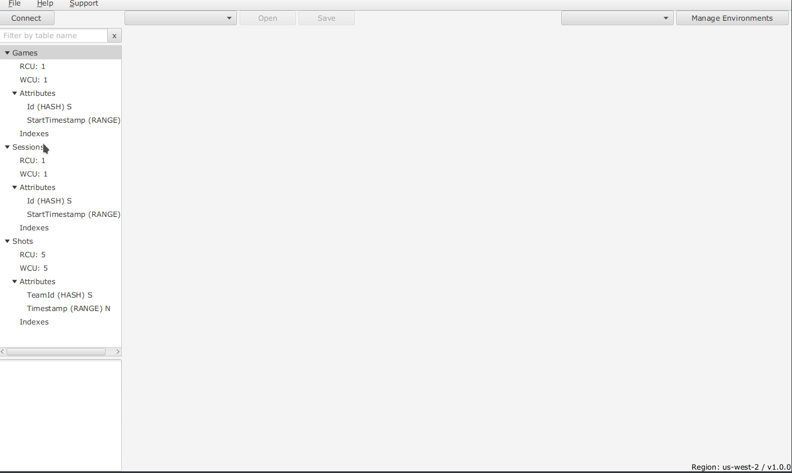
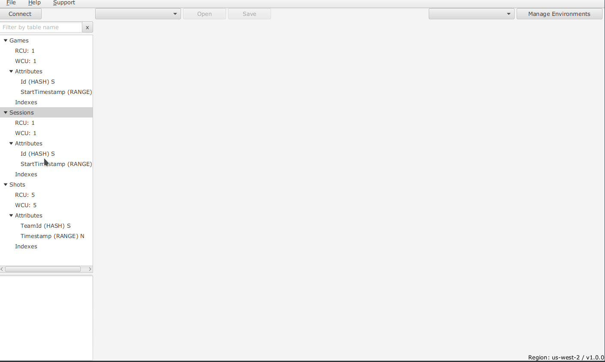
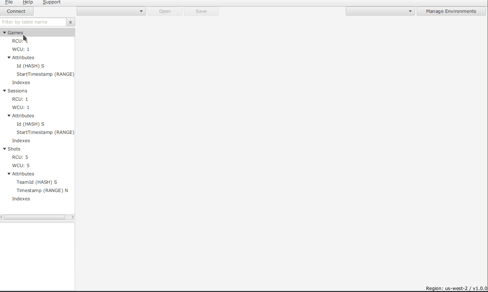

## Dynoman - DynamoDB management UI

### Connect

### Tables Filter

### Copy

### Query Clipboard

### Sessions Save and Open

### Apply Function

### Scan/Query using Function

### Foreign Queries

See [Wiki/Foreign Query](https://github.com/zshamrock/dynoman/wiki/Foreign-Query) for more details.

#### Normal

#### User input

#### Collection

****

### To run

`gradle run`

To install `gradle` best way is to use [SDKMAN!](https://sdkman.io/): `sdk install gradle`.

### Support :heart:

You can support this (and other projects) on [Patreon](https://www.patreon.com/akazlou) :+1: and :star2: it here on GitHub! 
